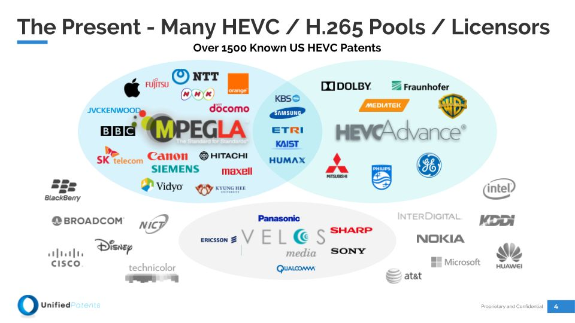

# Patent Licensing

## IEEE 

---

[Understanding Patent Issues During IEEE Standards Development](https://standards.ieee.org/content/dam/ieee-standards/standards/web/documents/other/patents.pdf)

[A complete package of patent-related materials](http://standards.ieee.org/about/sasb/patcom/materials.html)

[Accepted letters of assurance](http://standards.ieee.org/about/sasb/patcom/patents.html)

---

## H.265

---

### 3 major SEP pools

[MPEG LA](https://www.mpegla.com/)

[HEVC Advance](https://www.hevcadvance.com/)

[Velos Media](http://velosmedia.com/)

